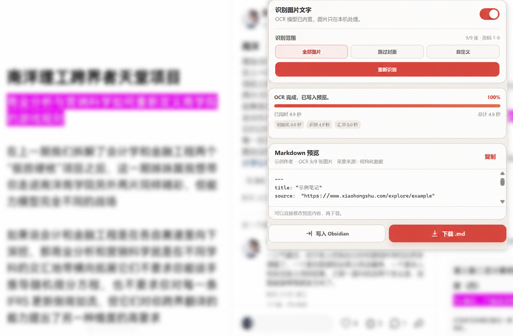
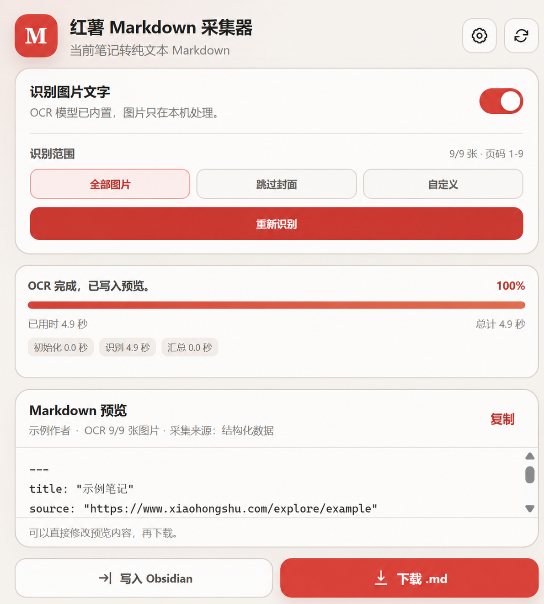
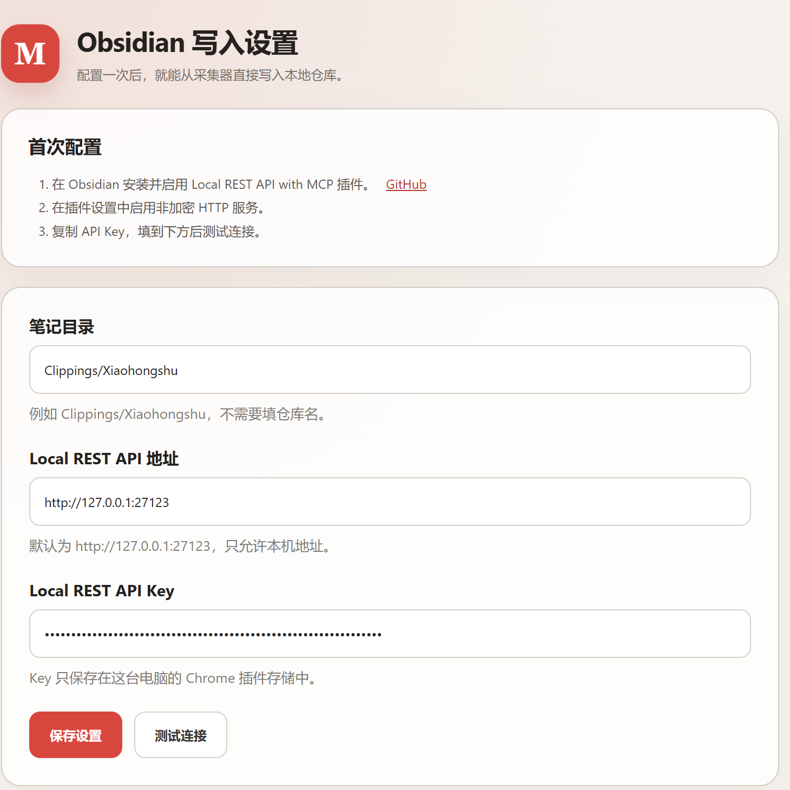

# XHS Clipper

[](https://www.google.com/chrome/)
[](https://www.typescriptlang.org/)
[](https://github.com/PaddlePaddle/PaddleOCR)
[](https://github.com/LinkisLethe/xhs-clipper)
[](LICENSE)

[简体中文](README.zh-CN.md)

XHS Clipper is a Chrome extension that turns the currently open Xiaohongshu image post into editable plain-text Markdown. It captures the written post and can recognize text inside selected images on your device. You can download the result as a `.md` file or write it directly to a local Obsidian vault.



## Features

- Capture the title, body, author, tags, publish time, engagement counts, source URL, and image order.
- Run optional local OCR on all images, everything except the cover, or a custom page range.
- Repair common Chinese-English spacing, broken lines, paragraph breaks, and exact OCR duplicates.
- Preview and edit Markdown before exporting it.
- Download a `.md` file or write it to Obsidian through a local REST API.
- Check for an existing Obsidian note and ask before overwriting it.
- Use a Simplified Chinese or English interface based on Chrome's display language.

OCR runs with bundled PP-OCRv6 Tiny models. Images and recognized text are not sent to a remote OCR service.

## Install from source

You need Node.js 20 or newer and pnpm.

```bash
pnpm install
pnpm verify
```

The build is written to the `dist` directory. Open Chrome and enter `chrome://extensions/` in the address bar. Enable Developer mode, select **Load unpacked**, then choose this project's `dist` directory.

After installation, pin XHS Clipper to the Chrome toolbar. Open a Xiaohongshu image post and click the extension icon.

## Capture and OCR

The popup first reads the post body and metadata. Turn on **Recognize text in images**, choose the pages you need, then select **Start OCR** or **Run OCR again**.



The first OCR job initializes the local ONNX runtime. Later jobs reuse the loaded engine. Long images are divided into smaller sections and merged in source order. If one image fails, the extension continues with the remaining images.

Post-processing repairs layout without rewriting the source. You can also edit the preview before copying, downloading, or writing it to Obsidian.

## Write to Obsidian

Direct writing uses the [Local REST API with MCP](https://github.com/coddingtonbear/obsidian-local-rest-api) community plugin. Obsidian must be open when XHS Clipper writes a note.

### 1. Get the local API address and key

1. In Obsidian, open **Settings > Community plugins > Browse**.
2. Install and enable Local REST API with MCP.
3. Open its settings and enable the non-encrypted HTTP server.
4. Copy the `Non-encrypted (HTTP) API URL` and API key.

<details>
<summary>View the Obsidian plugin settings example</summary>


</details>

### 2. Configure XHS Clipper

1. Click the gear button in the top-right corner of the popup.
2. Enter a note folder, such as `Clippings/Xiaohongshu`.
3. Enter the local API address. The default is `http://127.0.0.1:27123`.
4. Paste the API key, save the settings, and select **Test connection**.



The API key stays in extension storage for the current Chrome profile. XHS Clipper only accepts `127.0.0.1` and `localhost` addresses. Do not publish the API key in screenshots, issues, or logs.

## Markdown output

Each file contains YAML frontmatter, the written post, and OCR text in image order. The default filename is `title_author_date.md`. XHS Clipper exports text only. It does not download or embed the original images.

```markdown
---
title: "Example note"
source: "https://www.xiaohongshu.com/explore/example"
platform: "xiaohongshu"
author: "Example author"
ocr: true
---

# Example note

## Post

Post text...

## Image text

### Image 1

Recognized text...
```

## Current scope

XHS Clipper handles one user-opened Xiaohongshu image post at a time. It does not capture comments, search creators or profile pages, collect accounts in bulk, publish or interact with posts, download image files, or use a cloud database.

See the [privacy policy](docs/PRIVACY.md) and [permission reference](docs/PERMISSIONS.md) for details about local data processing and browser access.

## Responsible use

XHS Clipper is an independent, unofficial project. It is not affiliated with, endorsed by, or sponsored by Xiaohongshu. Xiaohongshu and related names and marks belong to their respective owners.

Use the extension only for content you are permitted to access and process. You are responsible for following applicable laws, copyright rules, and platform terms. Do not republish, sell, or distribute other people's content without permission.

## Development

```bash
pnpm test
pnpm build
pnpm verify
```

The code is split into page extraction, OCR, text post-processing, Markdown export, and Obsidian writing. Future search or Skill entry points can reuse the existing `Note` data structure.

OCR uses Apache-2.0 licensed PP-OCRv6 Tiny models and the MIT licensed `onnxruntime-web` runtime. Image preprocessing and result decoding follow the public behavior of PaddleOCR.js, with Canvas and TypeScript replacing OpenCV. Product and data-structure references include Obsidian Web Clipper, Bilibili Obsidian Clipper, ChatGPT Exporter, xiaohongshu-mcp, and xiaohongshu-skills. Their application code was not copied into this project.

XHS Clipper is licensed under the [Apache License 2.0](LICENSE). See [THIRD_PARTY_NOTICES.md](THIRD_PARTY_NOTICES.md) for model, runtime, and attribution details. Version history is in [CHANGELOG.md](CHANGELOG.md).
