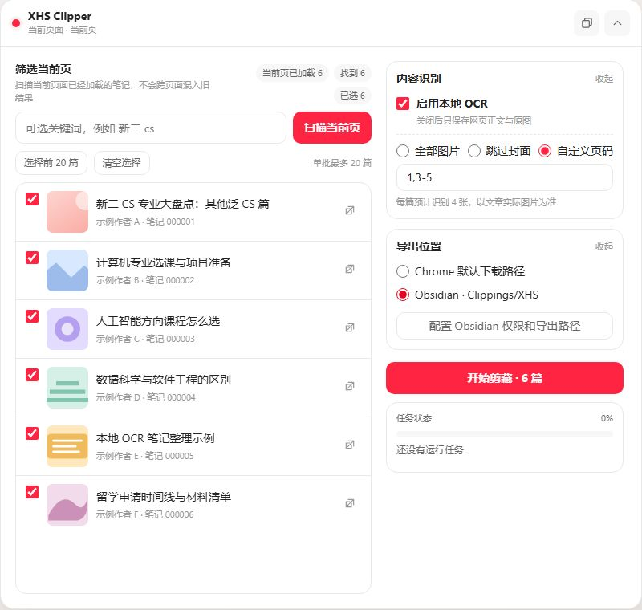
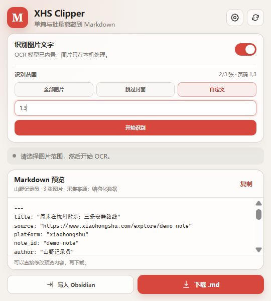
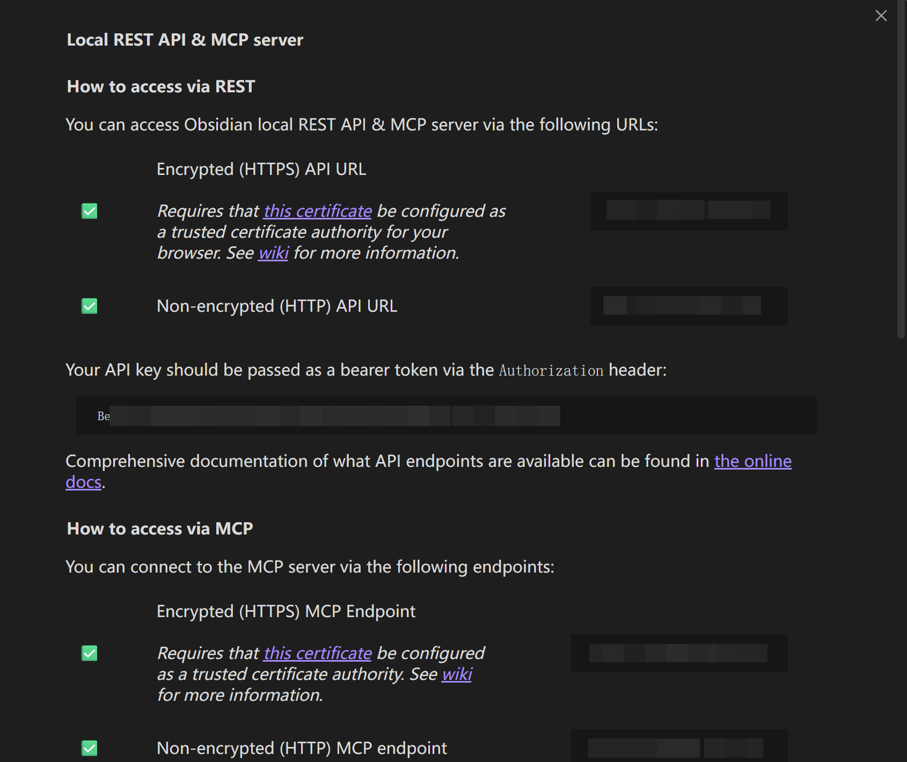
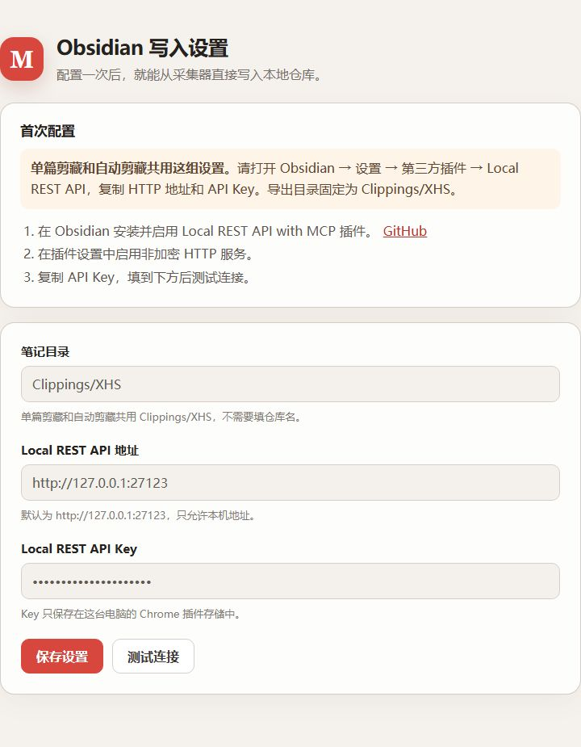

[简体中文](README.zh-CN.md) | [English](README.md)

<p align="center">
  
</p>

<h1 align="center">XHS Clipper</h1>

<p align="center">Clip one or more Xiaohongshu posts into editable, plain-text Markdown.</p>

<p align="center">
  <a href="https://www.google.com/chrome/"></a>
  <a href="https://www.typescriptlang.org/"></a>
  <a href="https://github.com/PaddlePaddle/PaddleOCR"></a>
  <a href="https://github.com/LinkisLethe/xhs-clipper/releases/latest"></a>
  <a href="LICENSE"></a>
</p>

XHS Clipper is a Chrome extension for saving Xiaohongshu image posts as editable Markdown. Use the popup for one open post, or use the floating workspace on the home feed, search results, creator profiles, and post pages to select a small batch. OCR runs locally in Chrome. Each result can be downloaded as a `.md` file or written to a local Obsidian vault.

<p align="center">
  
</p>

## Features

- Capture the title, body, author, tags, publish time, engagement counts, source URL, and image order.
- Scan the post cards already loaded on the current page, filter titles by keyword, and select up to 20 posts per batch.
- Run optional local OCR on all images, everything except the cover, or a custom page range.
- Follow per-post progress and remaining time, or stop safely after the current post.
- Repair common Chinese-English spacing, broken lines, paragraph breaks, and exact OCR duplicates.
- Preview and edit Markdown before exporting it.
- Download a `.md` file or write it to Obsidian through a local REST API.
- Handle an existing Obsidian note by skipping it, saving a new version, or overwriting the matching source note.
- Remember OCR, output, section, and collapsed-window choices in the current Chrome profile.
- Follow Chrome's display language: `zh_CN` uses Simplified Chinese, `zh_TW` uses Traditional Chinese, and every other locale uses English.

OCR runs with bundled PP-OCRv6 Tiny models. Images and recognized text are not sent to a remote OCR service.

## Installation

### Install the packaged extension

1. Open the [latest release](https://github.com/LinkisLethe/xhs-clipper/releases/latest) and download `xhs-clipper-v1.0.0.zip` from **Assets**. Do not download GitHub's automatically generated **Source code** archives.
2. Extract the ZIP to get the `xhs-clipper-v1.0.0` folder. Chrome cannot load the ZIP directly.
3. Open `chrome://extensions/` and enable **Developer mode**.
4. Select **Load unpacked**, then choose the extracted `xhs-clipper-v1.0.0` folder.

The packaged extension does not require Node.js or pnpm. After installation, pin XHS Clipper to the Chrome toolbar and reload any Xiaohongshu tabs that were already open.

When upgrading an unpacked copy, copy the new files over the folder Chrome already loads and select **Reload** on the extension card. This keeps the extension ID and local settings. If you load the new version folder separately, disable or remove the old copy first so two floating workspaces do not appear.

### Build from source

Building from source requires Node.js 20 or newer and pnpm.

```bash
pnpm install
pnpm verify
```

The build is written to the `dist` directory. Load that directory from `chrome://extensions/`.

## Batch clipping workspace

The floating workspace is available on the Xiaohongshu home feed, search results, creator profiles, and individual post pages. Select **Scan current page** to read only the cards already loaded in that tab. Scroll first and scan again if you need more results. Existing results are cleared when the page route changes.

Enter one or more keywords separated by spaces. Every keyword must appear in the normalized title. Select individual posts or choose the first 20, review the OCR and output summary, then start the batch. XHS Clipper opens the selected posts one at a time in inactive tabs and closes each tab after processing it.

The panel shows the current stage, elapsed time, estimated time remaining, and the result for each post. The stop button finishes the current post before canceling the rest. Selecting a post title opens that post in the current tab.

Automated access can still trigger platform rate limits or account checks. Keep batches small, avoid repeated runs, and stop if Xiaohongshu asks for login verification or a captcha.

## Single-post capture and OCR

The popup first reads the post body and metadata. Turn on **Recognize text in images**, choose the pages you need, then select **Start OCR** or **Run OCR again**.

<p align="center">
  
</p>

The first OCR job initializes the local ONNX runtime. Later jobs reuse the loaded engine. Long images are divided into smaller sections and merged in source order. If one image fails, the extension continues with the remaining images.

Post-processing repairs layout without rewriting the source. You can also edit the preview before copying, downloading, or writing it to Obsidian.

## Write to Obsidian

Direct writing uses the [Local REST API with MCP](https://github.com/coddingtonbear/obsidian-local-rest-api) community plugin. Obsidian must be open when XHS Clipper writes a note.

### 1. Get the local API address and key

1. In Obsidian, open **Settings > Community plugins > Browse**.
2. Install and enable Local REST API with MCP.
3. Open its settings and enable the non-encrypted HTTP server.
4. Copy the `Non-encrypted (HTTP) API URL` and API key.

<details>
<summary>View the Obsidian plugin settings example</summary>



</details>

### 2. Configure XHS Clipper

1. Open settings from the popup gear button or select **Configure Obsidian permissions and export path** in the floating workspace.
2. Confirm the shared export folder, `Clippings/XHS`.
3. Enter the local API address. The default is `http://127.0.0.1:27123`.
4. Paste the API key, save the settings, and select **Test connection**.

<p align="center">
  
</p>
The API key stays in extension storage for the current Chrome profile. XHS Clipper only accepts `127.0.0.1` and `localhost` addresses. Do not publish the API key in screenshots, issues, or logs.

## Markdown output

Each file contains YAML frontmatter, the written post, and OCR text in image order. The default filename is `title_author_date.md`. XHS Clipper exports text only. It does not download or embed the original images.

```markdown
---
title: "Example note"
source: "https://www.xiaohongshu.com/explore/example"
platform: "xiaohongshu"
author: "Example author"
ocr: true
---

# Example note

## Post

Post text...

## Image text

### Image 1

Recognized text...
```

## Responsible use

XHS Clipper is an independent, unofficial project. It is not affiliated with, endorsed by, or sponsored by Xiaohongshu. Xiaohongshu and related names and marks belong to their respective owners.

Use the extension only for content you are permitted to access and process. You are responsible for following applicable laws, copyright rules, and platform terms. Do not republish, sell, or distribute other people's content without permission.

## Development

```bash
pnpm test
pnpm build
pnpm verify
pnpm benchmark:job
pnpm benchmark:ocr
```

The OCR benchmark is built and served separately so benchmark assets never enter the extension package. Set `CHROME_PATH` if Chrome is not installed at the platform default path. Use `OCR_BENCHMARK_ITERATIONS` and `OCR_BENCHMARK_WARMUP` to change the run length.

The code is split into page extraction, OCR, text post-processing, Markdown export, and Obsidian writing. Future search or Skill entry points can reuse the existing `Note` data structure.

OCR uses Apache-2.0 licensed PP-OCRv6 Tiny models and the MIT licensed `onnxruntime-web` runtime. Image preprocessing and result decoding follow the public behavior of PaddleOCR.js, with Canvas and TypeScript replacing OpenCV. Product and data-structure references include Obsidian Web Clipper, Bilibili Obsidian Clipper, ChatGPT Exporter, xiaohongshu-mcp, and xiaohongshu-skills. Their application code was not copied into this project.

XHS Clipper is licensed under the [Apache License 2.0](LICENSE). See [THIRD_PARTY_NOTICES.md](THIRD_PARTY_NOTICES.md) for model, runtime, and attribution details. Version history is in [CHANGELOG.md](CHANGELOG.md).
